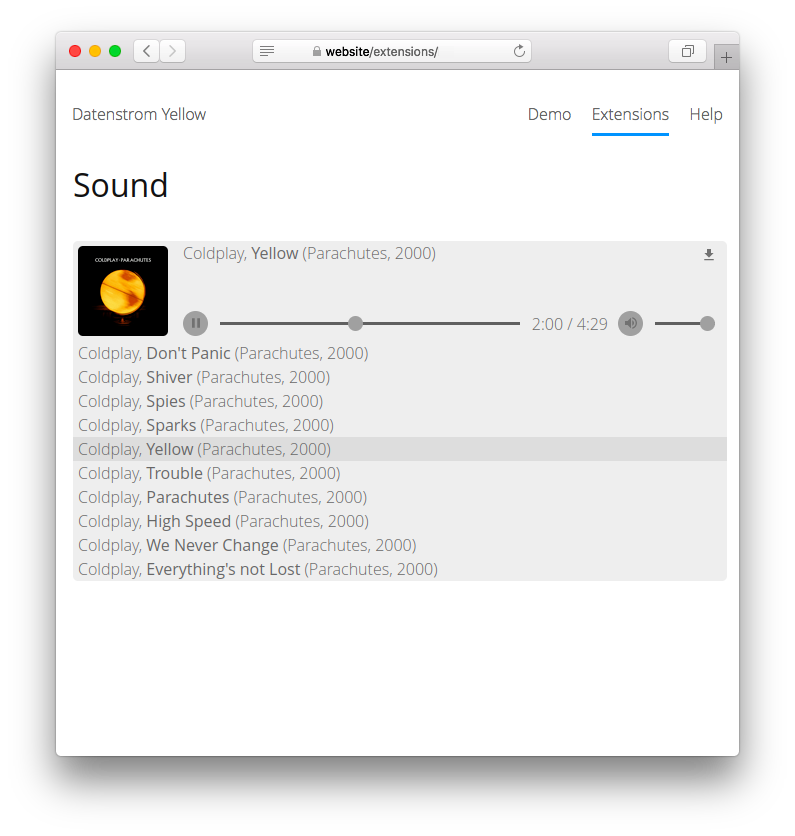

# Sound 0.9.2

Add audio tracks.

## How to install an extension

[Download ZIP file](https://github.com/GiovanniSalmeri/yellow-sound/archive/refs/heads/main.zip) and copy it into your `system/extensions` folder. [Learn more about extensions](https://github.com/annaesvensson/yellow-update).

## How to add audio tracks

Create a `[sound]` shortcut. 

The following argument are available, the second argument is optional:
 
`Source` = audio source, name or url  
`Label` = description of the audio, wrap multiple words into quotes, [supported placeholders](#placeholders)  

The audio formats MP3, OPUS, OGG, FLAC, M4A and WAV and the playlist formats M3U and PLS are supported. All media files are located in the `media` folder. The `media/sounds` folder is the place to store your audio files. You can also create additional folders and organise files as you like.

The following placeholders for titles are supported:

`@artist`, `@composer`, `@performer`, `@album`, `@work`, `@title`, `@subtitle`, `@disc`, `@track`, `@date`, `@genre`, `@radio`

The values assigned to placeholders come from metadata, which are normally present in audio files. If necessary, you can fix them with programs known as "tag editors" (sometimes included in audio players) or with an [online service](https://tagmp3.net/).

If you want an image to be shown in the custom player, place it in the same folder as the audio file or playlist, with the name of the latter (e.g. `my_song.jpg`) or `cover` (e.g. `cover.jpg`).

For embedding audio tracks from streaming services there is the [Embed](https://github.com/GiovanniSalmeri/yellow-embed) extension.

## How to add a playlist

Create a text file with the extension `m3u`, e.g. `my_playlist.m3u`. Write the filename of each track in a line, for example:

    song_1.mp3
    song_2.mp3
    song_3.mp3

You can also use relative paths and URLs.

Use the filename of the playlist as `source`.

## How to add an Internet radio

Use the URL of the radio as `source`.

## Examples

Adding an audio track, different tracks:

    [sound my_song.mp3]
    [sound violin/ciaccona.flac]

Adding a playlist:

    [sound my_playlist.m3u]

Adding an Internet radio:

    [sound https://icestreaming.rai.it/5.mp3]

Adding an audio track, custom label:

    [sound my_song.mp3 "@title by @artist (performed in @date)"]

## Settings

The following settings can be configured in file `system/extensions/yellow-system.ini`:

`SoundLocation` = location for audio tracks  
`SoundDefaultTitle` = default title for tracks  
`SoundDefaultTitleRadio` = default title for radios  
`SoundComposerAsArtist` = treat the composer (instead of the performer) as the artist, 1 or 0  
`SoundFileNamePattern` = pattern for scanning file names, when metadata are missing  
`SoundShowDownloadLink` = show download link, 1 or 0  

## Developer

Giovanni Salmeri. [Get help](https://datenstrom.se/yellow/help/).
